# Create build agent image

In previous steps you setup all required connections and credentials, so that you can build virtual machine image of your build agent.

## Build agent configuration

Microsoft hosted agents images are built automatically and microsoft open-sourced the configuration scripts in [GitHub repository](https://github.com/Microsoft/azure-pipelines-image-generation). This is very good starting point and you can use the same scripts. Optionally you can modify those to change some software installation or configuration.

Microsoft uses [Packer](https://www.packer.io/) to build agent image. Packer is nice tool for building virtual machine images. It works with [Azure](https://azure.microsoft.com/), [AWS](https://aws.amazon.com/), [Google Cloud](https://cloud.google.com/), [Hyper-V](https://www.microsoft.com/en-us/server-cloud/solutions/virtualization.aspx), [VMware](https://www.vmware.com/), and many more. Basically it does following steps:
1. Starts a new virtual machine.
2. Executes steps specified in JSON template.
3. Stops the virtual machine and saves it to an image.

At the GitHub repo there are several images. This article focuses on **Hosted 2017** that is defined in template file _images/win/vs2017-Server2016-Azure.json_. At first fork the whole repository at GitHub, where you will manage your changes. This way, when Microsoft releases a new version of the template, you can easily merge it into your repository. Microsoft stores releases in branches _releases/YYMM_. Find the latest release and checkout your own branch. Now you can do changes in the template. First section in the template JSON defines, where the image is created. It is created in Microsoft Azure in specified subscription and resource group.

To make installation more secure remove the hardcoded password. Find line
```json
    "install_password": "P@ssw0rd1"
```
and replace it with line
```json
    "install_password": "{{env `INSTALL_PASSWORD`}}"
```

Second section defines set of PowerShell scripts, which are executed and install and verify software on the build agent. Configuration of full build agent takes more than 8 hours. Therefore I recommend that you remove installation steps, which you don't need.

Example of modified Packer configuration can be found in repository [duracellko/azure-pipelines-image-generation](https://github.com/duracellko/azure-pipelines-image-generation/tree/duracellko/1901.1/images/win).

## Create build pipeline

When you commit all the changes and push the branch to GitHub, you are ready to create Azure Pipeline to build the image. The build is very simple, it just runs Packer to build the image.

1. In Azure DevOps select **Pipelines** from menu and then **Builds**.
2. Click **New build pipeline**.
3. Click **Use the visual designer**.


4. Select **GitHub** as source and select your forked repository.

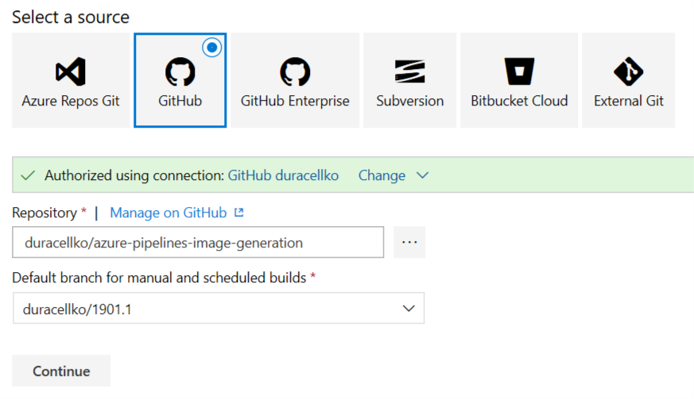

5. Click **Continue**.
6. Click on "Start with an **Empty job**".
7. Set **Name** to _Build Agent Image_.
8. Set **Agent pool** to Default. This assumes that there is already an agent image in your Default pool. You can use also hosted agent pool, but you have to purchase at least 1 parallel pipeline. Otherwise the build gets cancelled after 30 minutes.

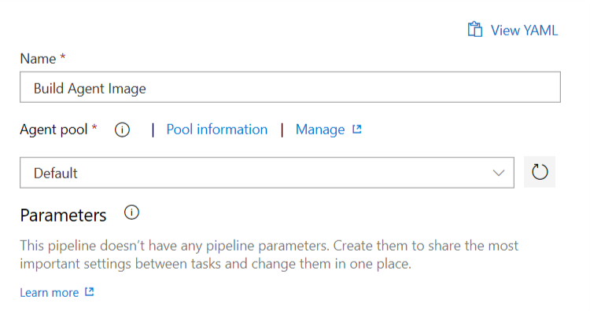

9. Select **Get sources** section.
    1. Set **Clean** to "true" and **Clean options** to "All build directories".

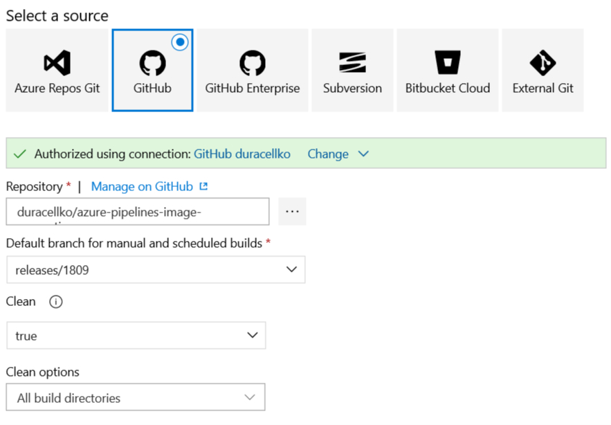

10. Select **Variables** section.
    1. Add variable named **PackerVMInstallPassword**. This will be password of user that will install software on the agent. This password is used in legacy commands and therefore maximum length is 16 characters.

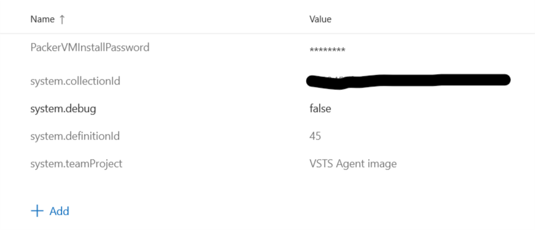

11. Open **Variable groups** section.
    1. Click **Link variable group**.
    2. Select **Azure subscription** group and click **Link**.
    3. Click **Link variable group**.
    4. Select **Azure resources** group and click **Link**.

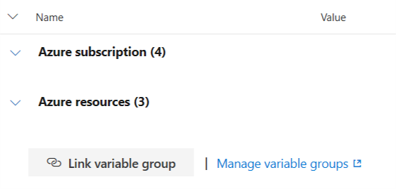

12. Open **Options** section.
    1. Set **Build job timeout in minutes** to 1440. That is 24 hours.

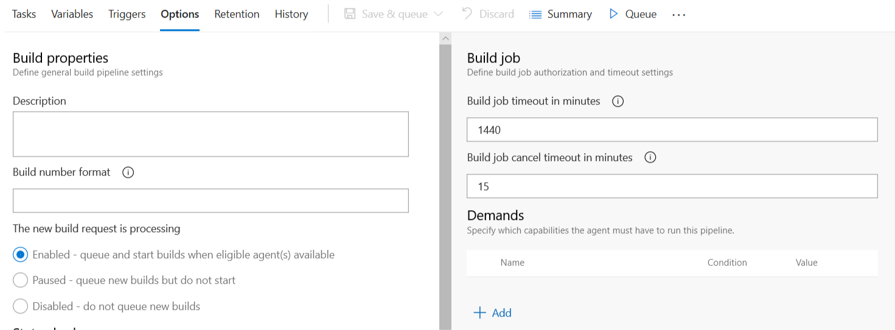

13. Open **Tasks** section and select **Agent job**.
    1. Set **Display name** to "Build image".
14. Click **Add task** and select **Download Build Artifacts**. Then set following values:
    - **Display Name**: Download Build Scripts
    - **Specific build**
    - **Project**: Current Azure DevOps project
    - **Build pipeline**: Build scripts
    - **Build version to download**: Latest from specific branch and specified Build Tags
    - **Branch name**: refs/heads/master
    - **Build Tags**: _empty_
    - **Specific artifact**
    - **Artifact name**: build
    - **Matching pattern**: **
    - **Destination directory**: `$(Build.BinariesDirectory)\scripts`

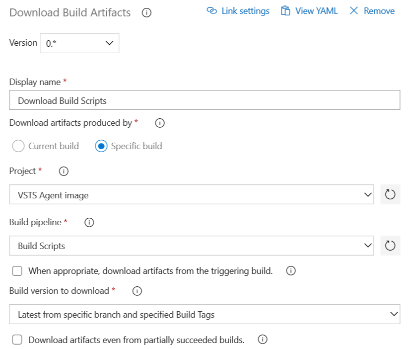

15. Click **Add task** and select **Copy Files**. Then set following values:
    - **Display name**: Copy Files - Build Scripts
    - **Source Folder**: `$(Build.BinariesDirectory)\scripts\build`
    - **Contents**: **
    - **Target Folder**: `$(System.DefaultWorkingDirectory)\scripts`
    - **Clean Target Folder**: checked
    - **Overwrite**: checked

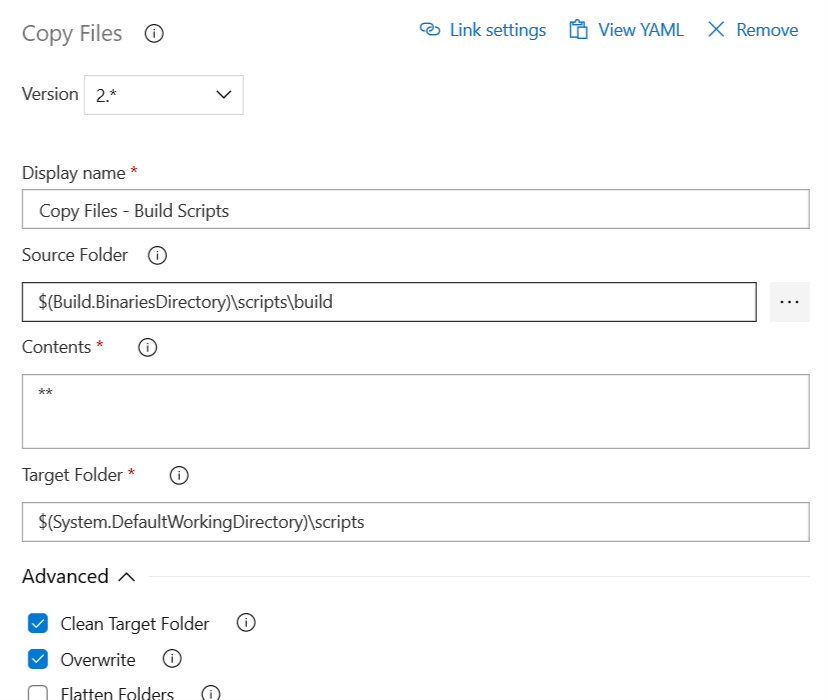

16. Click **Add task** and select **PowerShell**. Then set following values:
    - **Display name**: PowerShell Script
    - **File Path**
    - **Script Folder**: `scripts/BuildImage.ps1`
    - **Arguments**: `-SPClientId "$(Azure.ClientId)" -SPClientSecret "$(Azure.ClientSecret)" -SubscriptionId "$(Azure.SubscriptionId)" -TenantId "$(Azure.TenantId)" -Location "$(Azure.Location)" -RGName "$(Azure.ResourceGroup)" -StorageAccountName "$(Azure.StorageAccountName)" -InstallPassword "$(PackerVMInstallPassword)"`
    - **ErrorActionPreference**: Stop

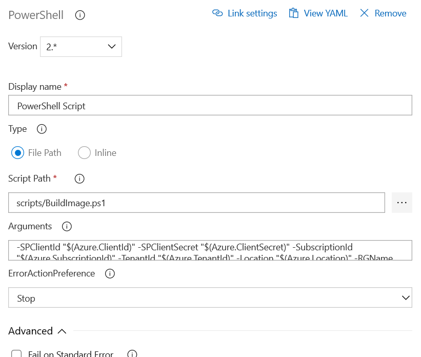

17. Click **Add task** and select **Copy Files**. Then set following values:
    - **Display name**: Copy Files - VHD URI
    - **Source Folder**: `$(Build.BinariesDirectory)`
    - **Contents**:
        ```
        *.txt
        *.md
        ```
    - **Target Folder**: `$(Build.StagingDirectory)\image`
    - **Clean Target Folder**: unchecked
    - **Overwrite**: unchecked

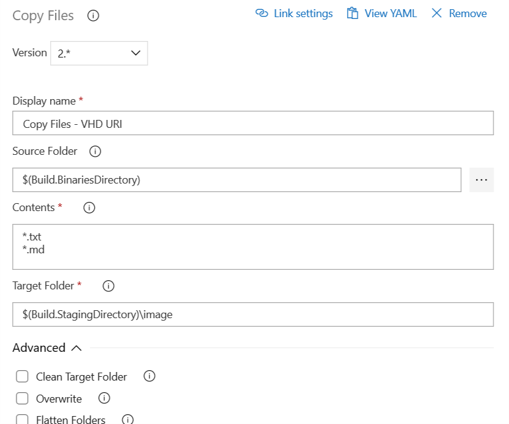

18. Click **Add task** and select **Publish Build Artifacts**. Then set following values:
    - **Display Name**: Publish Artifact: image
    - **Path to publish**: `$(Build.StagingDirectory)\image`
    - **Artifact name**: image
    - **Artifact publish location**: Azure Pipelines/TFS

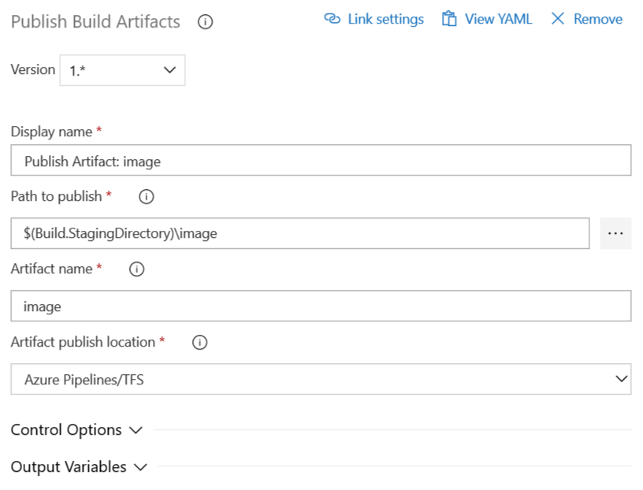

19. **Save** the pipeline.
20. Queue the build. Do not forget to specify branch that you want to build.

After several hours a disk image (VHD file) should be created and stored in the Azure Storage that you created in the first task. Additionally build artifacts contain markdown file with all installed software.

Next step: [Deploy build agent](Deploy_build_agent.md)
